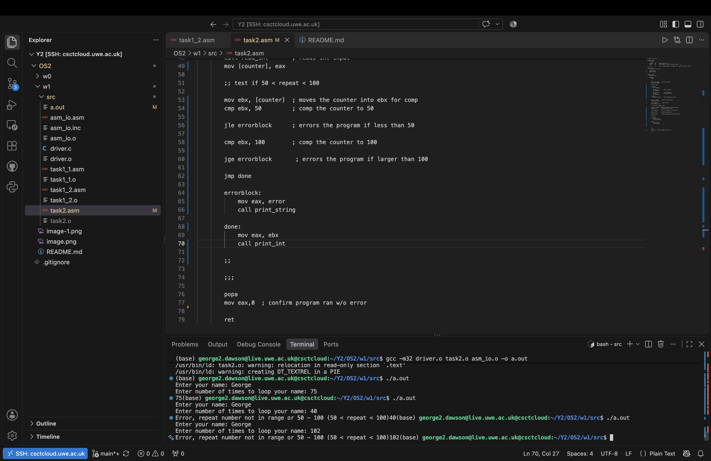
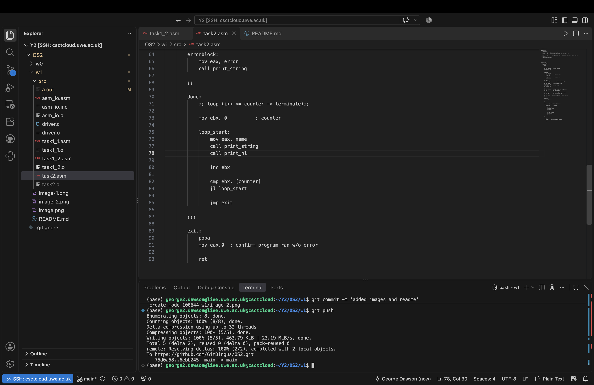
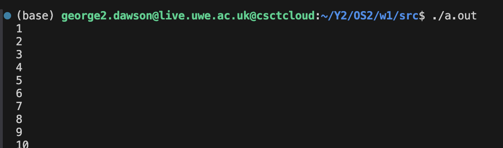
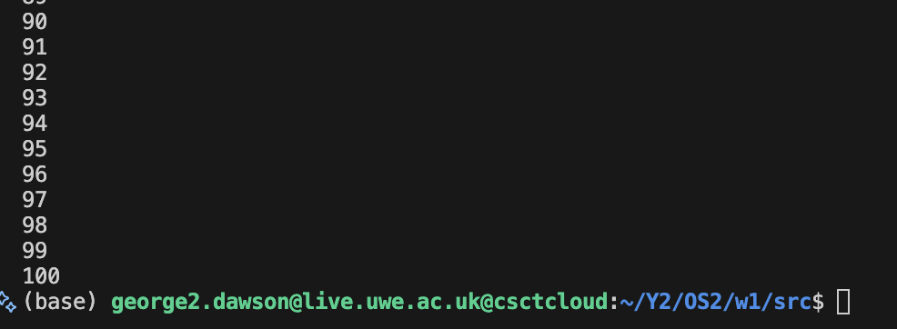

Worksheet 1 @ OS2 UWE

You can see that the output is '21', meaning the program works, since the code specifies int1 being 15 and int2 being 6, which is 21.

This is from task1_2. The prompt works correctly, and does the maths correctly as well. You can see that 10 + 20 does equal 30, which is what i entered

This is the control flow and comparisons from Task 2. You can see in the CLI that my comparisons work perfectly, since it prints an error if 50 < number < 100

This is my implementation of the loop required to print the name X amount of times. I decided on a range-based for loop, since it would be easy to implement. All i did was set ebx to the value of 0, and incremented it by 1 on every iteration, exiting the loop when it reaches Counter, the user defined loop limit

These two images are from Task 2_2, with the array with nunbers 1-100. I decided to go for a kind of unorthodox approach, where i would define a space for 100 integers in .bss, then fill them in with a for loop, by doing bitwise maths on the esi register to add 4 bytes, or 32 bits, to the dword, then filling in that space with the ecx register, which gets continuously incremented on every pass, until it reaches 100. For the sake of simplicity i only screenshotted the first and last 10 numbers outputted.